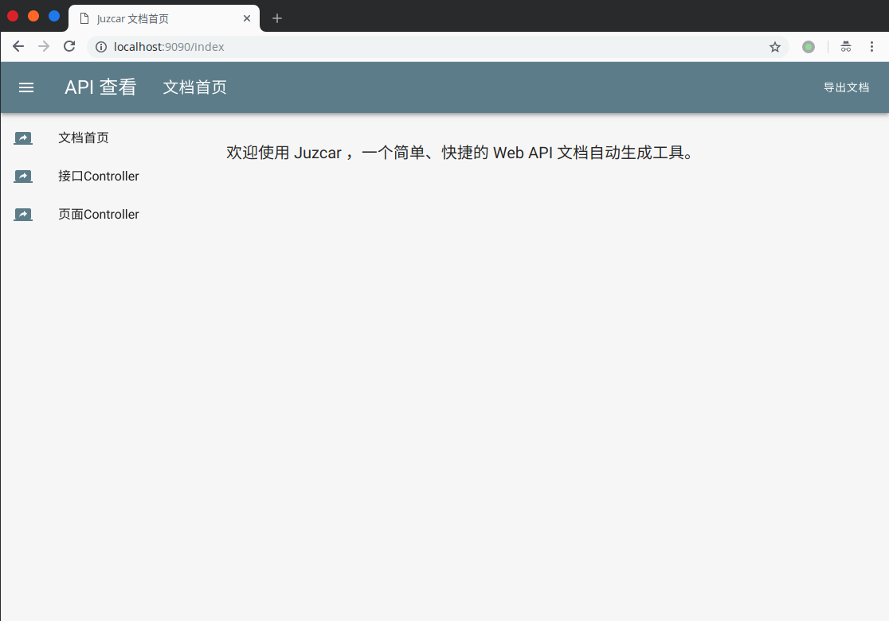
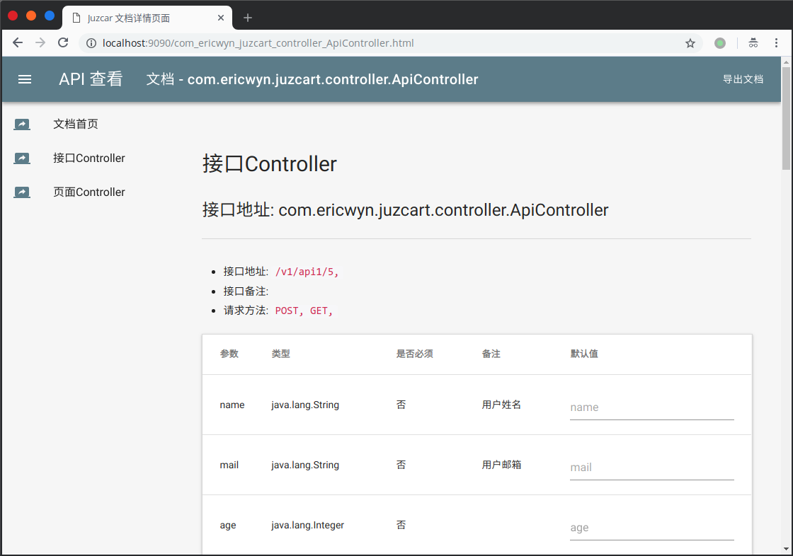
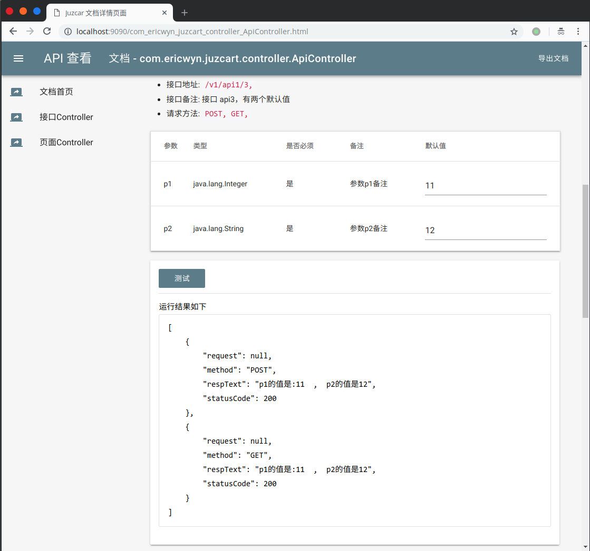

# Juzcar

RESTful API document auto-generation tools, depends on the Spring framework

## Feature
 - automatic analysis Controller and the annotations, and then generate the api messages
    - @Controller
    - @RestController
    - @RequestMapping
    - @PostMapping
    - @GetMapping
    - @RequestBody
    - @ResponseBody
    - @RequestParam
 - online preview API document
 - export all the API document pages in one Zip file
 - test the api in document preview pages

## Usage
### Maven
 - Step 1. Add the JitPack repository to your build file
    
        <repositories>
            <repository>
                <id>jitpack.io</id>
                <url>https://jitpack.io</url>
            </repository>
        </repositories>
  
 - Step 2. Add the dependency
        
        <dependency>
            <groupId>com.github.Ericwyn</groupId>
            <artifactId>Juzcar</artifactId>
            <version>Tag</version>
        </dependency>

## Gradle
 - Step 1. Add it in your root build.gradle at the end of repositories:
           
        allprojects {
            repositories {
                ...
                maven { url 'https://jitpack.io' }
            }
        }
 
 - Step 2. Add the dependency
        
        dependencies {
                implementation 'com.github.Ericwyn:Juzcar:Tag'
        }

## Download JAR
You can download the JAR file in [JitPack](https://jitpack.io/#Ericwyn/Juzcar)
 - open the log about one commit's build, just like
    > https://jitpack.io/com/github/Ericwyn/Juzcar/e6a171b897/build.log
 - and find the path about the build JAR in log, like
    > com/github/Ericwyn/Juzcar/e6a171b897/Juzcar-e6a171b897.jar
 - download the JAR with this path, in 
    > https://jitpack.io/com/github/Ericwyn/Juzcar/e6a171b897/Juzcar-e6a171b897.jar\

## Run Preview
 - 
 
 - 
 
 - 